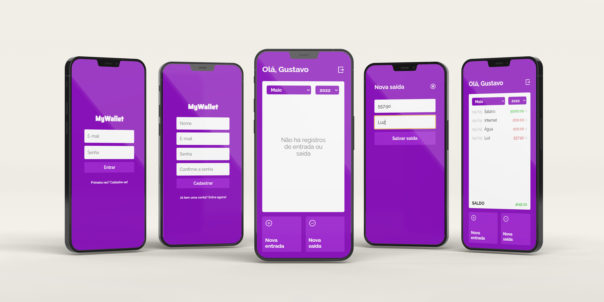

<p align="center">
  <a href="https://github.com/lgsfarias/MyWallet">
    
  </a>

  <h3 align="center">
    myWallet
  </h3>
  <p align="center">
    Financial Control App
    <br />
    <a href="https://github.com/lgsfarias/MyWallet"><strong>Explore the docs »</strong></a>
    <br />
</p>

<br/>

<br/><br/>

<details>
  <summary><h2 style="display: inline-block">Abstract</h2></summary>
  <ol>
    <li>
      <a href="#built-with">Built With</a>
    </li>
    <li><a href="#routes">Routes</a></li>
    <li><a href="#deploy-link">Deploy Link</a></li>
    <li><a href="#contact">Contact</a></li>
  </ol>
</details>

<br/>

## Built With

Web application to financial control.


<br/>

## Routes

```
- /
  - Route to Login
- /home
  - Route to homepage
- /newtransaction/:type
  - Route to register a new transaction (type = entrada/saida)
- /edit/:id
  - Route to edit a transaction
```

<br/>

## Back End

<a href="https://github.com/lgsfarias/MyWalletAPI"><strong>myWallet API</strong></a>

## Deploy Link

<a href="https://my-wallet-lgsfarias.vercel.app/"><strong>myWallet deploy</strong></a>

<br />

## Contact

<div>
  <a href="https://www.linkedin.com/in/lgsfarias" target="_blank"></a>
  <a href = "mailto:lgsfarias.dev@gmail.com"></a>
</div>
